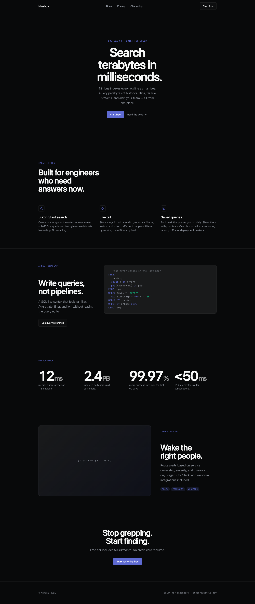

# hara-design

**Design in the [hara](https://github.com/hara-cli/hara) CLI.** Talk to hara in your terminal; it generates
self-contained HTML — landing pages, dashboards, app prototypes, decks — in any of **138 brand-grade design
systems**, and you preview it **live in your browser**. You drive entirely from the CLI; the web is view-only
(no web-side chat).

It ships as a hara **plugin**: one `design` skill + a tiny live-reload preview server + a catalog of design
systems, skill recipes, craft rules, and device frames.



> Above: generated end-to-end from a one-line brief in the `linear-app` system, rendered live in the preview.

```
you (hara CLI) ──talk──▶ hara (the design engine)
                              │ writes index.html
                              ▼
                    .hara/design/<slug>/index.html
                              │ fs.watch
                              ▼
              preview/server.mjs ──live-reload──▶ your browser
```

## Local workflow — install · open · develop · export

**1. Install the plugin** (into `~/.hara/plugins/design`):
```bash
hara plugin add github:hara-cli/hara-design      # from GitHub
# — or, developing locally, from a clone:
hara plugin add file:~/work/projects/hara/hara-design
```
Optional — get the `hara-design` helper command (preview/export from anywhere):
```bash
cd hara-design && npm link        # provides the global `hara-design` command
```
Verify: `hara doctor` lists `design` under skills and plugins.

**2. Design — talk to hara** (in any hara session):
```
hara
> a dark, modern-minimal landing page for a developer log-search tool, use the linear-app design system
```
hara locks a short brief, picks/confirms a **design system**, writes `index.html` to `.hara/design/<slug>/`,
and starts the live preview — open the printed `http://127.0.0.1:<port>`.

**3. Open / preview** (any existing design dir, outside a session):
```bash
hara-design open                 # newest .hara/design/<slug> under cwd, opens the browser
hara-design preview ./path/to/dir --port 4321
```
The preview hot-reloads on every file change.

**4. Develop / iterate** — just talk to hara ("make the hero bigger, narrow the sidebar"); each edit auto-reloads
the browser. Before finalizing, hara self-checks against the recipe's **P0 checklist + a 5-dimension critique**
(anti-AI-slop). Add your own systems/recipes under `skills/design/references/` (then `npm run build-index`).

**5. Export & handoff**:
```bash
# PDF (headless Chrome; decks print as slides)
hara-design export  .hara/design/<slug>/index.html [--out out.pdf]

# Agent handoff — hand the design to a FRONTEND CODING AGENT to build the production app:
hara-design handoff .hara/design/<slug>/index.html --target tailwind   # or css | swiftui | flutter | all
```
`handoff` emits a `handoff/` folder a downstream agent can build from:
- `reference.html` — the design (visual ground truth)
- `tokens.json` — design tokens in [DTCG](https://www.designtokens.org) format (`{alias}` refs)
- `theme/<target>` — tokens pre-mapped for your stack (`tailwind.config.js` / `tokens.css` / `Theme.swift` / `app_theme.dart`)
- `components.md` + `HANDOFF.md` — the skill fills these with the component breakdown + build instructions, so a
  frontend agent reads the folder and rebuilds the app faithfully, using token references (never raw values).

## What's inside
- `skills/design/SKILL.md` — the driver: the staged design quality workflow (brief → direction → plan → build →
  checklist → critique → emit), adapted to the CLI.
- `skills/design/references/design-systems/` — **138** `DESIGN.md` systems + an `INDEX.md` (regenerate with
  `node scripts/build-ds-index.mjs`).
- `skills/design/references/skills/` — **54** recipe `SKILL.md` (landing, dashboard, deck, mobile, report…).
- `skills/design/references/craft/` — anti-AI-slop / color / typography rules.
- `frames/` — pixel-accurate device frames (iPhone, Android, iPad, MacBook, browser) for multi-screen prototypes.
- `preview/server.mjs` — zero-dependency static + live-reload preview server.
- `scripts/build-ds-index.mjs` — regenerate the design-systems index. `scripts/export.mjs` — print to PDF.

## Credits / license
Apache-2.0. Design content + the design workflow are adapted from
[Open Design](https://github.com/nexu-io/open-design) (Apache-2.0) — see `NOTICE`.
